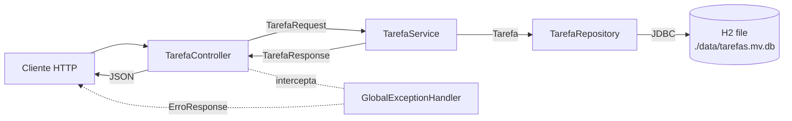

# API de Gerenciamento de Tarefas

API REST para CRUD de tarefas pessoais, com persistência local em H2 (modo arquivo), validação via Bean Validation e respostas de erro padronizadas. MVP — sem autenticação, sem múltiplos usuários, sem anexos.

## Stack

- Java 11
- Spring Boot 2.7.18
  - `spring-boot-starter-web`, `spring-boot-starter-data-jpa`, `spring-boot-starter-validation`, `spring-boot-starter-actuator`, `spring-boot-starter-test`
- H2 Database (modo arquivo, gerenciada pelo parent do Spring Boot)
- springdoc-openapi-ui 1.7.0 (Swagger UI)
- JUnit 5, Mockito, AssertJ (via `spring-boot-starter-test`)
- Maven (com Maven Wrapper `./mvnw`)

## Arquitetura

Arquitetura clássica em camadas: o cliente HTTP entra pelo `TarefaController`, que valida o payload via Bean Validation e delega para o `TarefaService`. O service aplica regras de negócio (defaults de enum, validação de `dataVencimento` em `America/Sao_Paulo`, mapeamento entidade↔DTO) e usa o `TarefaRepository` (Spring Data JPA) para persistir no H2 em modo arquivo. Erros propagam para o `GlobalExceptionHandler` (`@RestControllerAdvice`), que devolve `ErroResponse` no formato padronizado.



```
src/main/java/com/toDo/tarefas/
├── TarefasApplication.java
├── config/
│   └── OpenApiConfig.java
├── controller/
│   └── TarefaController.java
├── service/
│   └── TarefaService.java
├── repository/
│   └── TarefaRepository.java
├── entity/
│   ├── Tarefa.java
│   └── enums/
│       ├── StatusTarefa.java
│       └── Prioridade.java
├── dto/
│   ├── TarefaRequest.java
│   ├── TarefaResponse.java
│   ├── AtualizarStatusRequest.java
│   ├── ErroResponse.java
│   └── ErroCampo.java
└── exception/
    ├── TarefaNaoEncontradaException.java
    ├── DadosInvalidosException.java
    └── GlobalExceptionHandler.java
```

## Pré-requisitos

- JDK 11
- Git
- (Opcional) IntelliJ IDEA ou VS Code

Maven não é necessário — o projeto inclui Maven Wrapper (`./mvnw`).

## Instalação

```bash
git clone <URL-do-repositório>
cd ToDo-IA-ms
./mvnw clean compile
```

A pasta `data/` é criada automaticamente na primeira execução com o arquivo `tarefas.mv.db` (H2).

Para gerar um JAR executável (útil para distribuição ou execução fora do Maven):

```bash
./mvnw clean package
java -jar target/tarefas-0.0.1-SNAPSHOT.jar
```

## Execução

```bash
./mvnw spring-boot:run
```

Aplicação sobe em **`http://localhost:8080`**. Sem porta customizada — usa o default do Spring Boot.

URLs principais:

| URL | O que é |
|-----|---------|
| `http://localhost:8080/api/tarefas` | API REST do recurso Tarefa |
| `http://localhost:8080/health` | Health check do Actuator (remapeado de `/actuator/health`) |
| `http://localhost:8080/h2-console` | Console H2 — JDBC URL `jdbc:h2:file:./data/tarefas`, user `sa`, sem senha |
| `http://localhost:8080/swagger-ui.html` | Swagger UI (redireciona para `/swagger-ui/index.html`) |
| `http://localhost:8080/v3/api-docs` | Especificação OpenAPI 3 em JSON |

Para confirmar que está no ar:

```bash
curl http://localhost:8080/health
```

Resposta esperada:

```json
{"status":"UP"}
```

## Endpoints

Base path: `/api/tarefas`.

| Método | Path | Descrição | Status sucesso | Erros possíveis |
|--------|------|-----------|----------------|-----------------|
| `POST` | `/api/tarefas` | Cria uma nova tarefa | 201 + header `Location` | 400 |
| `GET` | `/api/tarefas` | Lista tarefas; filtros opcionais por `status` e `prioridade` | 200 | 400 (filtro inválido) |
| `GET` | `/api/tarefas/{id}` | Busca uma tarefa por id | 200 | 400, 404 |
| `PUT` | `/api/tarefas/{id}` | Atualiza uma tarefa (substituição completa) | 200 | 400, 404 |
| `DELETE` | `/api/tarefas/{id}` | Remove uma tarefa | 204 | 400, 404 |

> O `PATCH /api/tarefas/{id}/status` está previsto como `RF-007` na release 2 e ainda não foi implementado.

### Exemplos

#### POST — criar tarefa

```bash
curl -i -X POST http://localhost:8080/api/tarefas \
  -H "Content-Type: application/json" \
  -d '{
    "titulo": "Revisar pull request #42",
    "descricao": "Validar testes da camada de service e cobertura.",
    "prioridade": "ALTA",
    "dataVencimento": "2026-12-31"
  }'
```

Resposta `201 Created` com header `Location: http://localhost:8080/api/tarefas/1`:

```json
{
  "id": 1,
  "titulo": "Revisar pull request #42",
  "descricao": "Validar testes da camada de service e cobertura.",
  "status": "PENDENTE",
  "prioridade": "ALTA",
  "dataVencimento": "2026-12-31",
  "criadoEm": "2026-05-03T14:22:31Z",
  "atualizadoEm": "2026-05-03T14:22:31Z"
}
```

#### GET — listar (com filtros opcionais)

```bash
curl http://localhost:8080/api/tarefas
curl "http://localhost:8080/api/tarefas?status=PENDENTE"
curl "http://localhost:8080/api/tarefas?status=EM_ANDAMENTO&prioridade=ALTA"
```

Resultado ordenado por `criadoEm` em ordem decrescente.

#### GET — buscar por id

```bash
curl http://localhost:8080/api/tarefas/1
```

#### PUT — atualizar (substituição completa)

```bash
curl -i -X PUT http://localhost:8080/api/tarefas/1 \
  -H "Content-Type: application/json" \
  -d '{
    "titulo": "Revisar pull request #42 (atualizado)",
    "descricao": "Conferir tambem o changelog.",
    "status": "EM_ANDAMENTO",
    "prioridade": "ALTA",
    "dataVencimento": "2026-05-12"
  }'
```

`criadoEm` é preservado; `atualizadoEm` reflete o instante do update.

#### DELETE — remover

```bash
curl -i -X DELETE http://localhost:8080/api/tarefas/1
```

Resposta `204 No Content` (corpo vazio).

## Modelo de dados

Entidade `Tarefa`, mapeada para a tabela `tarefas`.

| Campo | Tipo Java | Coluna SQL | Restrições | Default |
|-------|-----------|------------|------------|---------|
| `id` | `Long` | `BIGINT` | PK, auto-incremento (IDENTITY) | — |
| `titulo` | `String` | `VARCHAR(120)` | obrigatório, 1–120 caracteres (após trim) | — |
| `descricao` | `String` | `VARCHAR(1000)` | opcional, máximo 1000 caracteres | `NULL` |
| `status` | `StatusTarefa` | `VARCHAR(20)` | obrigatório | `PENDENTE` |
| `prioridade` | `Prioridade` | `VARCHAR(10)` | obrigatório | `MEDIA` |
| `dataVencimento` | `LocalDate` | `DATE` | opcional; na criação, deve ser hoje ou futuro em `America/Sao_Paulo` | `NULL` |
| `criadoEm` | `OffsetDateTime` | `TIMESTAMP WITH TIME ZONE` | obrigatório, imutável após criação; gravado em UTC | servidor |
| `atualizadoEm` | `OffsetDateTime` | `TIMESTAMP WITH TIME ZONE` | obrigatório; atualizado em cada `PUT`; gravado em UTC | servidor |

Enums:

- `StatusTarefa`: `PENDENTE`, `EM_ANDAMENTO`, `CONCLUIDA`, `CANCELADA`
- `Prioridade`: `BAIXA`, `MEDIA`, `ALTA`

Os enums são persistidos como `VARCHAR` (`@Enumerated(EnumType.STRING)`).

## Tratamento de erros

Todas as respostas de erro seguem o formato:

```json
{
  "timestamp": "2026-05-03T14:22:31Z",
  "status": 400,
  "error": "Bad Request",
  "message": "Erro de validação",
  "path": "/api/tarefas",
  "errors": [
    { "field": "titulo", "message": "não deve estar em branco" }
  ]
}
```

O campo `errors` aparece apenas em erros de validação multi-campo (omitido no JSON quando ausente).

| Exceção | HTTP | Quando |
|---------|------|--------|
| `MethodArgumentNotValidException` | 400 | Falha de Bean Validation no `@RequestBody` |
| `ConstraintViolationException` | 400 | Falha em `@Min(1)` no path variable, ou outras constraints em parâmetros |
| `MethodArgumentTypeMismatchException` | 400 | Tipo de path/query inválido (id não numérico, enum desconhecido em filtro) |
| `HttpMessageNotReadableException` | 400 | JSON malformado ou enum inválido no body |
| `DadosInvalidosException` | 400 | Regra de negócio violada (ex.: `dataVencimento` no passado na criação, `status`/`prioridade` nulos no PUT) |
| `TarefaNaoEncontradaException` | 404 | Recurso inexistente em `GET/PUT/DELETE /{id}` |
| `Exception` (fallback) | 500 | Erro inesperado; mensagem interna não é exposta no body |

## Testes

Rodar todos os testes:

```bash
./mvnw test
```

Resultado esperado: 33 testes verdes (~15s).

Coberto:

- **`TarefaServiceTest`** — 16 testes unitários puros com Mockito (`@ExtendWith(MockitoExtension.class)`, sem subir contexto Spring). Cobre os 5 métodos do service, incluindo cenários de erro e a preservação de `criadoEm` no `atualizar`.
- **`TarefaControllerTest`** — 16 testes via `@WebMvcTest(TarefaController.class)` com `@MockBean TarefaService`. Cobre os 5 endpoints, asserções de status, header `Location`, JSON de erro padronizado e cenários do `GlobalExceptionHandler` (validação de body, type mismatch, JSON malformado, `@Min(1)` em path).
- **`TarefasApplicationTests`** — 1 teste de smoke que valida que o contexto Spring sobe.

Não coberto ainda (parte do backlog):

- Testes do `TarefaRepository` com `@DataJpaTest` (`RT-008`)
- Testes de integração ponta a ponta com banco real (`RT-009` ampliado)

Rodar uma classe específica:

```bash
./mvnw test -Dtest=TarefaServiceTest
./mvnw test -Dtest=TarefaControllerTest
```

## Configuração

- **Banco H2 (modo arquivo):** `jdbc:h2:file:./data/tarefas;AUTO_SERVER=TRUE`. Arquivo físico: `./data/tarefas.mv.db`. Pode ser sobrescrito via variáveis de ambiente `DATABASE_URL`, `DATABASE_USERNAME`, `DATABASE_PASSWORD` — ver [`.env.example`](.env.example).
- **Console H2:** habilitado em `http://localhost:8080/h2-console`. Credenciais default: usuário `sa`, senha vazia.
- **Schema:** Hibernate `ddl-auto=update` cria/altera a tabela automaticamente. Sem ferramenta de migration (Flyway/Liquibase) — registrado como dívida técnica em `escopo-todo.md` §2.
- **Timezone:** instantes (`criadoEm`, `atualizadoEm`) gravados e serializados em UTC com offset `Z`. Regra "hoje ou futuro" do `dataVencimento` é avaliada em `America/Sao_Paulo`.
- **Actuator:** apenas o endpoint `health` é exposto, remapeado de `/actuator/health` para `/health`.
- **OpenAPI:** Swagger UI em `/swagger-ui.html`, JSON em `/v3/api-docs`. `/health` não aparece na documentação (`springdoc.show-actuator=false`).
- **Profiles Spring:** não há profiles `dev`/`prod` separados — perfil único por enquanto (`RT-012` na release 3).

Para resetar o banco completamente:

```bash
rm -rf data/
```

Na próxima execução o schema é recriado vazio.

## Uso de IA no desenvolvimento

O projeto foi desenvolvido com auxílio do **Claude Code** (Anthropic) seguindo metodologia incremental documentada e revisada a cada etapa.

**Processo:**

1. **Requisitos** — definição de escopo técnico em `escopo-todo.md`, sob revisão crítica antes da implementação.
2. **Backlog por releases** — `docs/backlog.md` quebra o trabalho em IDs `RF`/`RT` com critérios de aceite testáveis, distribuídos em 3 releases (Core, Qualidade, Entrega final).
3. **Diagramas Mermaid** — `docs/diagramas.md` registra a arquitetura em camadas, fluxos de sucesso/erro e o diagrama de estados de `StatusTarefa`.
4. **Convenções** — `CLAUDE.md` consolida decisões de idioma (pt-BR no domínio, inglês em sufixos técnicos e nomes de pacotes), estrutura de camadas e estado atual do projeto.
5. **Implementação por camadas** — etapas isoladas, da entidade ao controller, cada uma fechada antes da próxima começar. O histórico de commits reflete a granularidade.
6. **Testes** — service com Mockito puro, controller com `@WebMvcTest`+`@MockBean`. Sem `@SpringBootTest` para garantir isolamento por construção.

**Decisões humanas** (não delegadas):

- Definição de escopo, regras de negócio, contrato JSON dos endpoints e do erro padronizado.
- Escolhas arquiteturais: stack, persistência, padrões de mapeamento (manual, sem MapStruct), idioma do código.
- Dívida técnica aceita conscientemente (ex.: `ddl-auto=update` no MVP, ausência de Flyway documentada).
- Revisão crítica de cada etapa, com decisão explícita de aceitar/rejeitar sugestões da IA.

**O que a IA fez:**

- Geração de código a partir de prompts estruturados (preservados em `docs/prompts/`).
- Sugestão de estrutura de pacotes, helpers, fixtures de teste.
- Verificação de consistência cruzada entre `escopo-todo.md`, backlog, diagramas e código.
- Sinalização de divergências quando o prompt contradizia o código real ou o escopo.

Todo código foi revisado e validado manualmente; o histórico de commits reflete as etapas incrementais com mensagens em Conventional Commits.

## Limitações conhecidas

- Sem autenticação/autorização — qualquer cliente HTTP acessa todos os endpoints.
- Sem paginação na listagem — `GET /api/tarefas` retorna todas as tarefas em uma única resposta.
- Sem versionamento de schema (Flyway/Liquibase) — Hibernate `ddl-auto=update` é aceito como dívida técnica.
- Sem testes do repository (`@DataJpaTest`) e sem testes de integração ponta a ponta com banco real.
- Sem deploy configurado (Docker, container image, plataforma).
- Sem CI/CD — testes rodam apenas localmente via `./mvnw test`.
- H2 em modo arquivo — adequado para desenvolvimento, **não para produção**.
- Sem profiles `dev`/`prod` separados — configuração única.
- Endpoint `PATCH /api/tarefas/{id}/status` previsto no escopo (`RF-007`) ainda não implementado.

## Próximos passos

1. Migration de schema com Flyway ou Liquibase
2. Testes do repository (`@DataJpaTest`) e testes de integração ponta a ponta
3. Implementar `PATCH /api/tarefas/{id}/status` (`RF-007`)
4. Paginação na listagem (`Pageable`/`Page<T>`)
5. Profiles `dev` e `prod` em `application-{profile}.properties`
6. Migração para PostgreSQL em ambiente produtivo
7. Autenticação (Spring Security + JWT)
8. CI/CD (GitHub Actions com `./mvnw test` em cada PR)

## Documentação adicional

- [`docs/escopo-todo.md`](docs/escopo-todo.md) — escopo técnico, modelo de dados, regras de negócio
- [`docs/backlog.md`](docs/backlog.md) — backlog por release com IDs RF/RT e critérios de aceite
- [`docs/diagramas.md`](docs/diagramas.md) — arquitetura em camadas, fluxos de sucesso/erro, diagrama de estados
- [`CLAUDE.md`](CLAUDE.md) — convenções (idioma, pacotes, idioma do código)
- [`docs/postman/tarefas.postman_collection.json`](docs/postman/tarefas.postman_collection.json) — Postman Collection com cenários de teste manual

## Licença

Distribuído sob a licença **MIT**. Veja [`LICENSE`](LICENSE) para o texto completo.

```
Copyright (c) 2026 marcosandre19
```
