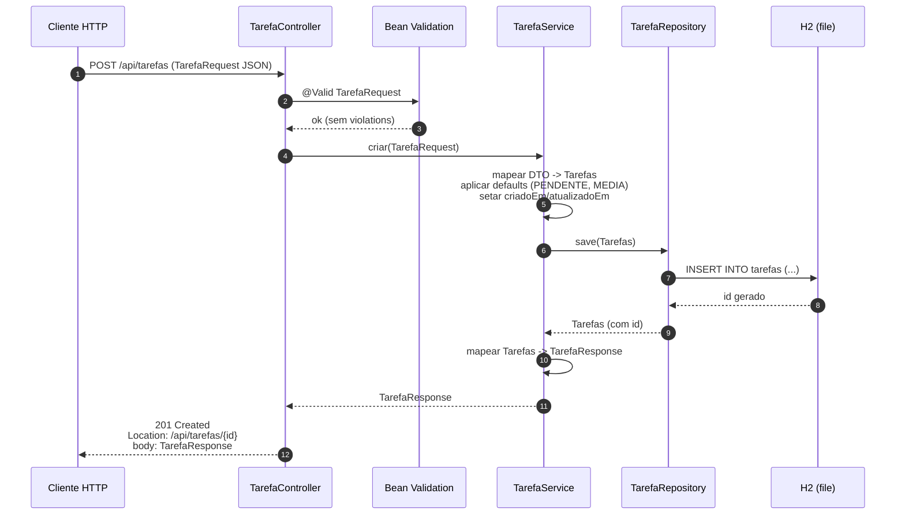
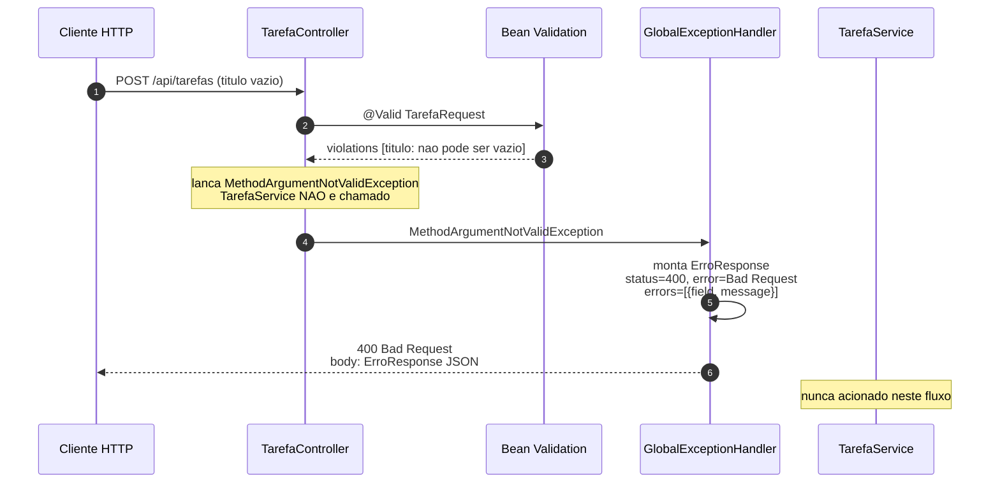
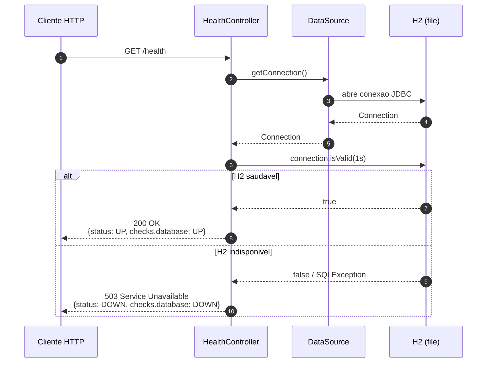
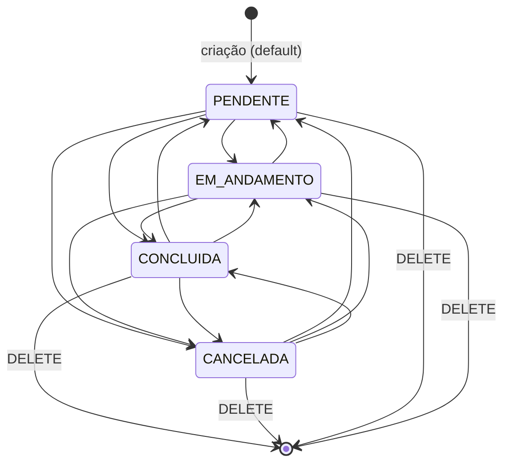

# Diagramas — API de Gerenciamento de Tarefas (MVP)

Diagramas de referência derivados de `escopo-todo.md` e `docs/backlog.md`. Componentes nomeados conforme a estrutura de pacotes da seção 7 do escopo.

## 1. Arquitetura em camadas

Visão estática das camadas do MVP, mostrando como o cliente HTTP atravessa Controller, Service e Repository até o H2 em modo arquivo, com componentes transversais (DTOs, Bean Validation e GlobalExceptionHandler) atuando sobre o fluxo.

```mermaid
flowchart TD
    Cliente[Cliente HTTP]

    subgraph Aplicacao[Spring Boot - com.toDo.tasks]
        subgraph Controller[controller]
            TC["TarefaController<br/>POST /api/tarefas<br/>GET /api/tarefas<br/>GET /api/tarefas/{id}<br/>PUT /api/tarefas/{id}<br/>PATCH /api/tarefas/{id}/status<br/>DELETE /api/tarefas/{id}"]
            HC["HealthController<br/>GET /health"]
        end

        subgraph Service[service]
            TS[TarefaService]
        end

        subgraph Repository[repository]
            TR["TarefaRepository<br/>(JpaRepository)"]
        end

        subgraph Transversais[Componentes transversais]
            DTO["dto<br/>TarefaRequest<br/>TarefaResponse<br/>AtualizarStatusRequest<br/>ErroResponse"]
            BV[Bean Validation<br/>javax.validation]
            GEH["exception<br/>GlobalExceptionHandler<br/>TarefaNaoEncontradaException"]
        end
    end

    H2[(H2 file<br/>./data/tarefas.mv.db)]

    Cliente -->|HTTP request JSON| TC
    TC -->|chama| TS
    TS -->|persiste / consulta| TR
    TR -->|JDBC| H2
    H2 -->|ResultSet| TR
    TR -->|Tarefas| TS
    TS -->|TarefaResponse| TC
    TC -->|HTTP response JSON| Cliente

    Cliente -->|GET /health| HC
    HC -->|isValid()| H2
    HC -->|HealthResponse JSON| Cliente

    DTO -.serializa.-> TC
    BV -.valida @Valid.-> TC
    GEH -.intercepta exceptions.-> TC
```

## 2. Fluxo de requisição bem-sucedida

Caminho completo de um `POST /api/tarefas` com payload válido, da chegada da requisição no Controller até a resposta `201 Created` com header `Location`. Cada camada devolve um valor à camada anterior.



## 3. Fluxo de requisição com erro de validação

Mesmo endpoint, mas com `titulo` vazio. A validação falha antes do Service ser chamado, o `GlobalExceptionHandler` intercepta a `MethodArgumentNotValidException` e devolve o JSON de erro padronizado da seção 6 do escopo.



Exemplo do corpo retornado em (5):

```json
{
  "timestamp": "2026-05-03T14:22:31",
  "status": 400,
  "error": "Bad Request",
  "message": "Erro de validação",
  "path": "/api/tarefas",
  "errors": [
    { "field": "titulo", "message": "não pode ser vazio" }
  ]
}
```

## 4. Fluxo do `GET /health`

Sequência da verificação de disponibilidade. O `HealthController` consulta o `DataSource` via `Connection#isValid(timeout)` e devolve `200 OK`/`UP` quando a conexão está saudável ou `503 Service Unavailable`/`DOWN` quando o H2 está inacessível.



## 5. Diagrama de estados — `StatusTarefa`

A entidade `Tarefas` possui o campo `status` com 4 valores definidos no escopo. A regra 8 da seção 5 declara que **transições são livres** no MVP — qualquer estado pode ir para qualquer outro via `PUT` ou `PATCH /api/tarefas/{id}/status`. O diagrama documenta os estados existentes e o default de criação.



---

## Diagramas omitidos

- **Diagrama ER (`erDiagram`) omitido** — o modelo de dados da seção 3 do escopo possui apenas a entidade `Tarefas`, sem relacionamentos com outras entidades. Os campos `status` e `prioridade` são enums armazenados como `VARCHAR`, não tabelas separadas.
